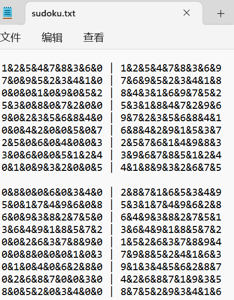

### 用户手册

##### 使用说明

用户可以通过命令行运行程序启动数独程序

通过使用不同参数选择生成数独棋盘。

数独生成器有可以生成终局棋盘，也可以生成数独游戏。


##### 参数说明

| 参数名称 | 参数含义                   | 参数使用范围 | 参数使用用例                                                | 
| -------- | -------------------------- | ------------ | ----------------------------------------------------------- | 
| -c       | 需要生成多少的终局棋盘     | 1-1000000    | shudu.exe -c 20                                          |
| -s       | 需要解的数独棋盘文件路径                   |绝对路径或相对路径              | shudu.exe -s Game.txt                                                | 单一参数即可                                       |
| -n       | 需要生成的带解密的棋盘数量 | 1-1000       | shudu.exe -n 1000          | 其中-m -r 和-u是可选参数，如果缺省则使用默认值 |
| - m      | 游戏难度                   | 1-3          | shudu.exe -n 100 -m 2                                       | 
| -r       | 挖空数量                   | 20~55        | shudu.exe -r 20~55                                          |
| -u       | 是否生成唯一解             |              |sudoku.exe -n 20 -u                                                             |


##### -c命令

：生成数独终局。示例命令行参数：sudoku.exe -c 20，表示生成20个数独终局。数独终局存放在Sudoku_Final_Set.txt中。


##### -s命令

-s：从文件中读取数独游戏并求解。示例命令行参数：sudoku.exe -s filename.txt。读取"filename"文件中的数独游戏，求解并将结果输出到"sudoku.txt"文件。



##### -n命令
-n：生成数独游戏。示例命令行参数：sudoku.exe -n 100，表示生成100个数独游戏存放在Game.txt中。


##### -m命令
-m：指定数独游戏的难度等级。示例命令行参数：sudoku.exe -n 1000 -m 1，表示生成游戏难度为简单的1000个数独游戏。

##### -r命令
-r：指定生成的数独游戏的挖空数范围。示例命令行参数：sudoku.exe -n 20 -r 20~55，表示生成挖空数在20到55之间的20个数独游戏。

##### -u命令
-u：指定生成的数独游戏的解唯一。示例命令行参数：sudoku.exe -n 20 -u，表示生成解唯一的20个数独游戏。


用户可以在sudoku.exe所在的文件夹下运行命令行控制程序输入sudoku.exe+相应的参数，若参数输入不正确则提示参数错误。


##### 相关函数介绍
sukudo.exe程序是一个生成和求解数独游戏的程序，下面是每个函数的功能介绍：

```cpp
void cmd_c(int suduku_final_num)
```
cmd_c函数用于生成数独终盘，并将生成的终盘输出到"Sudoku_Final_Set.txt"文件中，suduku_final_num用于表示终盘数量。

```cpp
void cmd_s(const char* filename)
```
cmd_s函数用于读取filename文件中的数独游戏，并对每个游戏进行求解，将求解结果输出到"sudoku.txt"文件中。

```cpp
void cmd_n(int game_num, int blank_num, bool only, int bottom = 0, int top = 0)
```
cmd_n函数用于生成指定数量的数独游戏，并将游戏输出到"Game.txt"文件中。游戏可以指定难度等级以及空格数。

```cpp
bool generate_final(int row, int col)
```
该函数用于生成数独终局，采用回溯法实现。

```cpp
bool generate_game(int blank_num, bool only)
```
该函数用于根据数独终局生成数独游戏，并根据指定的空格数和唯一解要求进行挖空操作。

```cpp
bool isValid(int arr[9][9], int row, int col, int num)
```
该函数用于判断在指定位置是否可以填入指定数字，检查行、列和小宫格是否满足填入条件。

```cpp
bool Solve()
```
该函数用于求解数独游戏，采用回溯法实现。

在主函数中，根据命令行参数调用不同的函数进行相关操作。当命令行参数不符合要求时，程序会输出提示信息。

用户可以根据自己的需求调用这些函数，生成数独终盘、数独游戏，或者对给定的数独游戏进行求解。


