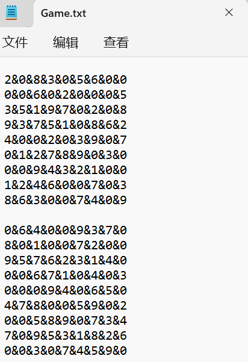
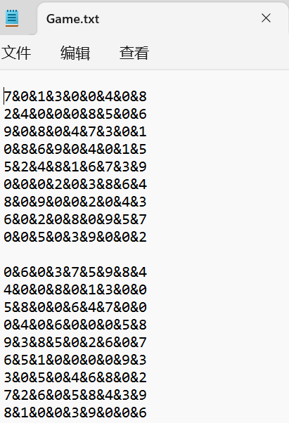
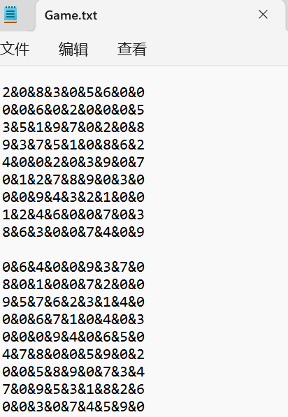
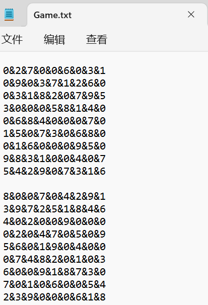
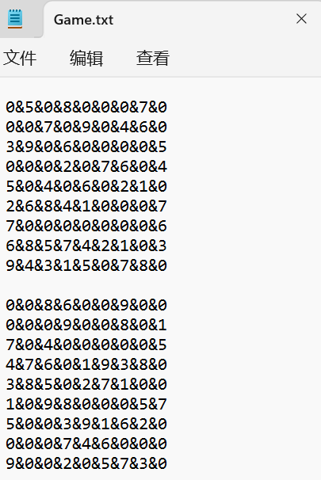
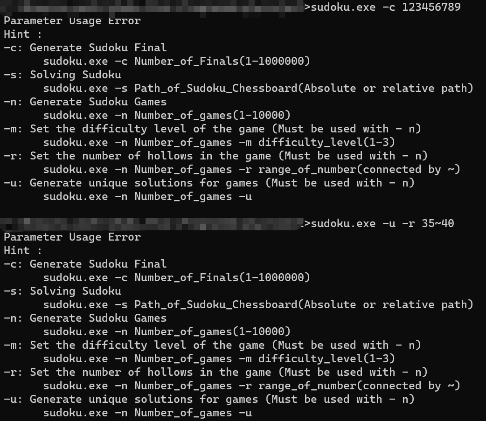

# <center> 用户手册 </center>

### **1.程序介绍**

#### 功能介绍

本程序为一个包含数独生成器和数独求解器的控制台程序。

数独生成器能够生成数独游戏、生成数独终局并输出到文件。

数独求解器可以从文件中读取数独问题，求解数独问题并输出到文件。

#### 程序特点

* 功能齐全：同时具有数独生成器与求解器功能，用户可按需选择使用。
* 控制台界面：控制台程序，界面简洁明了。
* 可定制性：该程序允许指定数独的难度、大小等参数，满足用户个性化需求。
* 开源：源代码公开，用户可根据需要进行二次开发和定制，也可以在其他操作系统上编译。

### **2.运行环境**
64位 Windows环境

### **3.使用说明**

用户在sudoku.exe文件目录下运行命令行控制程序，通过在命令行输入指令来运行程序。

用户通过通过对参数的选择实现数独游戏操作的选择。

在命令行中按参数说明中的要求输入sudoku.exe及相应的参数即可运行程序，输出结果，若参数输入不正确则提示命令错误并给出正确示例。

#### 参数说明

| 参数名称 | 参数含义                   | 参数使用范围 | 参数使用用例                                                | 参数使用要求         |
| -------- | -------------------------- | ------------ | ----------------------------------------------------------- | --------------------------------------------- |
| -c       | 需要生成多少的终局棋盘     | 1-1000000    | shudu.exe -c 20                                          | 单一参数即可 |
| -s       | 需要解的数独棋盘文件路径                   |绝对路径或相对路径              | shudu.exe -s Game.txt                                                | 单一参数即可  |                                     |
| -n       | 需要生成的带解密的棋盘数量 | 1-1000       | shudu.exe -n 1000          | 其中-m -r 和-u是可选参数，如果缺省则使用默认值 |
| - m      | 游戏难度                   | 1-3          | shudu.exe -n 100 -m  2| 必须与-n一起使用  |
| -r       | 挖空数量                   | 20~55        | shudu.exe -r 20~55                                          | 必须与-n一起使用  |
| -u       | 是否生成唯一解             |              |sudoku.exe -n 20 -u                                                             | 必须与-n一起使用  |

#### 输入输出说明
* 棋盘输入 ：
  仅在使用 -s 命令求解输入游戏棋盘时涉及到棋盘输入，输入文件为输入命令中指定的文件名。
  要求输入的游戏文件中棋盘存放格式如下：
  * 一个棋盘与一个棋盘间使用一个空行分隔
  * 棋盘存储形如9宫格，每行放9个数字，一个棋盘共9行，对应着实际九宫格游戏的数字位置。每行的9个数字使用“&”分隔开。
  
  示例如下：
  ```
    0&0&0&2&6&0&0&4&3
    2&7&0&4&0&8&0&0&6
    6&0&9&3&0&7&2&8&5
    3&6&7&1&2&0&4&9&8
    0&5&4&8&0&0&6&2&7
    9&8&0&0&7&0&0&5&0
    0&2&0&7&8&0&0&3&9
    8&3&0&9&4&0&1&0&0
    0&9&1&5&3&2&0&6&4

    0&4&9&7&0&2&0&8&6
    8&2&0&3&0&6&0&9&4
    6&5&1&0&9&4&0&0&2
    9&0&2&4&0&8&7&3&0
    0&0&5&1&2&0&4&0&0
    4&6&0&5&7&0&8&0&1
    0&0&8&9&4&5&6&1&3
    1&9&0&0&0&0&2&0&8
    0&3&0&2&0&1&9&4&7
  ```
* 棋盘输出 ：
  在使用所有命令都涉及到棋盘输出。
  * -c 命令输出终局：
    终局输出到sudoku.exe同目录下的Sudoku_Final_Set.txt中，格式与前面的输入文件的棋盘存储方式一致。
  * -n 命令输出游戏
    终局输出到sudoku.exe同目录下的Game.txt中，格式与前面的输入文件的棋盘存储方式一致。
  * -s 命令输出求解结果
    求解结果输出到sudoku.exe同目录下的sudoku.txt中。
    输出时
    * 每9行对应一个数独游戏，每个游戏间使用数独分隔，一个数独棋盘中同一行不同格的相邻数字使用“&”分隔
    * 每个数独游戏既输出原游戏棋盘，又输出求解后的答案棋盘。一行中先输出该行对应的游戏棋盘，然后输出“ | ”，再输出该行对应的棋盘
    形如：
    ```
    7&8&0&0&2&3&4&9&6 | 7&8&5&1&2&3&4&9&6
    2&0&9&7&4&0&0&5&1 | 2&6&9&7&4&8&3&5&1
    1&3&4&0&6&0&0&0&7 | 1&3&4&5&6&9&8&2&7
    0&0&0&4&3&0&7&0&2 | 5&9&8&4&3&6&7&1&2
    6&2&7&9&0&1&0&4&0 | 6&2&7&9&8&1&5&4&3
    0&4&1&2&5&0&9&6&0 | 3&4&1&2&5&7&9&6&8
    9&1&3&6&7&0&0&8&5 | 9&1&3&6&7&4&2&8&5
    0&0&2&8&1&0&0&3&9 | 4&7&2&8&1&5&6&3&9
    8&0&0&3&0&2&0&7&4 | 8&5&6&3&9&2&1&7&4
    ```
    左侧为原游戏棋盘，右侧为求得的游戏的解。

### **4.应用范例**

#### -c命令
生成数独终局。
示例 : sudoku.exe -c 20
—— 生成20个数独终局，数独终局存放在Sudoku_Final_Set.txt中。

<div align="center">

</div>
<!--  -->

#### -s命令
从文件中读取数独游戏并求解。
示例 : sudoku.exe -s Game.txt 
—— 读取Game.txt中的数独游戏，求解，将结果输出到"sudoku.txt"文件。

<div align="center">

</div>
<!--  -->

#### -n命令
生成数独游戏。
示例 ：sudoku.exe -n 100
—— 生成100个数独游戏存放在Game.txt中。

<div align="center">

</div>
<!--  -->

#### -m命令
指定数独游戏的难度等级。
示例 ：sudoku.exe -n 1000 -m 1，表示生成游戏难度为简单的1000个数独游戏。

<div align="center">

</div>

#### -r命令
指定生成的数独游戏的挖空数范围。
示例 ：sudoku.exe -n 20 -r 20~55，表示生成挖空数在20到55之间的20个数独游戏。

<div align="center">

</div>

#### -u命令
指定生成的数独游戏的解唯一。
示例 ：sudoku.exe -n 20 -u，表示生成解唯一的3个数独游戏。
<div align="center">

</div>

#### -u、-r、-m混用命令
示例 ：sudoku.exe -n 2 -u -r 35~40，表示生成解唯一的3个数独游戏。
<div align="center">

</div>

#### 错误的命令
示例1 ：sudoku.exe -c 123456789
示例2 ：sudoku.exe -u -r 35~40
<div align="center">

</div>

### **5.源代码说明**
sukudo.exe程序是一个生成和求解数独游戏的程序，由sudoku.cpp文件编译生成，下面是sudoku.cpp中重要函数的功能介绍：
#### 相关函数介绍
```cpp
void cmd_c(int suduku_final_num)
```
cmd_c函数用于生成数独终盘，并将生成的终盘输出到"Sudoku_Final_Set.txt"文件中，suduku_final_num用于表示终盘数量。

```cpp
void cmd_s(const char* filename)
```
cmd_s函数用于读取filename文件中的数独游戏，并对每个游戏进行求解，将求解结果输出到"sudoku.txt"文件中。

```cpp
void cmd_n(int game_num, int blank_num, bool only, int bottom = 0, int top = 0)
```
cmd_n函数用于生成指定数量的数独游戏，并将游戏输出到"Game.txt"文件中。游戏可以指定难度等级以及空格数。

```cpp
bool generate_final(int row, int col)
```
该函数用于生成数独终局，采用回溯法实现。

```cpp
bool generate_game(int blank_num, bool only)
```
该函数用于根据数独终局生成数独游戏，并根据指定的空格数和唯一解要求进行挖空操作。

```cpp
bool isValid(int arr[9][9], int row, int col, int num)
```
该函数用于判断在指定位置是否可以填入指定数字，检查行、列和小宫格是否满足填入条件。

```cpp
bool Solve()
```
该函数用于求解数独游戏，采用回溯法实现。

在主函数中，根据命令行参数调用不同的函数进行相关操作。当命令行参数不符合要求时，程序会输出提示信息。

用户可以根据自己的需求调用这些函数，生成数独终盘、数独游戏，或者对给定的数独游戏进行求解。


