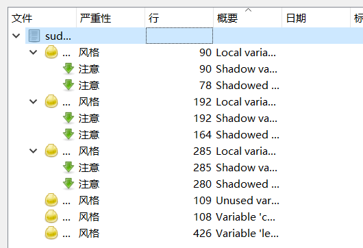
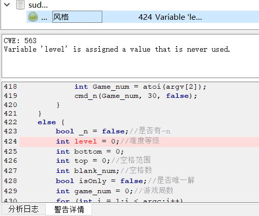
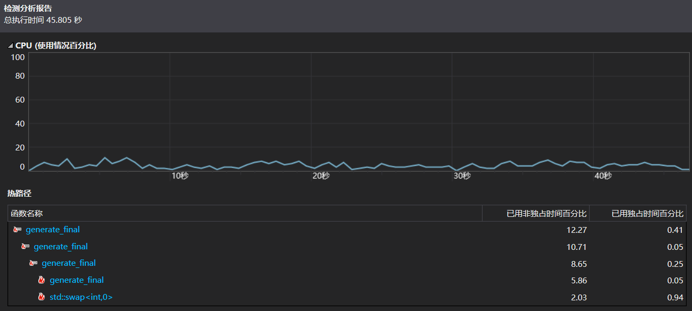
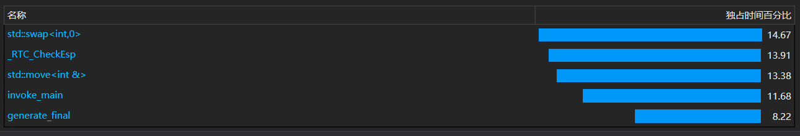
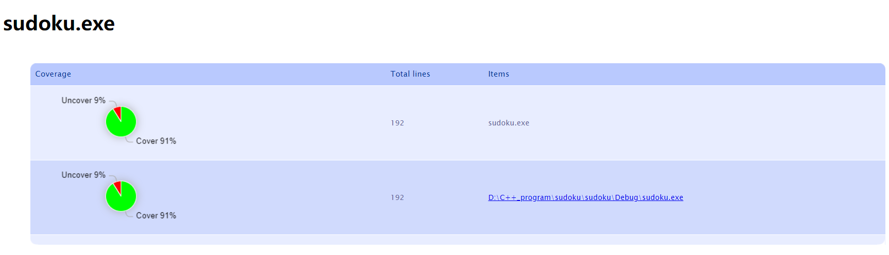

# 代码质量分析
## 静态分析

使用的工具
```sh
cppcheck 2.10
```

分析得到的结果如下：



可以看到静态分析出的错误包括：局部变量与外部变量重名、未使用的变量、被赋值且未被使用的变量。

如：
```sh
 int i = 0;
    while (i < suduku_final_num)
    {
        for (int i = 0; i < 9; i++) {
            for (int j = 0; j < 9; j++)
                outfile << Sudoku[i][j] << " ";
            outfile << endl;
        }
```

经过修改后静态分析只存在一个错误显示level变量未被使用过，但该参数实际在-m参数的功能中又被使用。由于静态分析存在一些局限性有时Cppcheck可能会产生一些误报或假阳性警告，即报告了并非真正存在问题的代码缺陷。

修改后的分析结果：



## 动态分析

使用visual studio 2019的性能嗅探器进行性能分析得到结果如下：





## 代码覆盖率



## 测试用例

```sh
sudoku -c 100
sudoku -c 10000
sudoku -s Game.txt
sudoku -n 100
sudoku -n 10 -u
sudoku -n 10 -m 2
sudoku -n 10 -r 20~55
```

相关bat文件
```cpp
@echo off

set SUDOKU_EXECUTABLE=sudoku.exe
set COVERAGE_REPORT=coverage_report.xml
set MERGED_COVERAGE_REPORT=merged_coverage_report.xml

rem Clean up previous coverage reports
del %COVERAGE_REPORT% 2>nul
del %MERGED_COVERAGE_REPORT% 2>nul

rem Test Case 1: sudoku -c 100
echo Test Case 1: Generating Sudoku Final Set (100 puzzles)...
OpenCppCoverage.exe -- %SUDOKU_EXECUTABLE% -c 100
echo.

rem Test Case 2: sudoku -c 10000
echo Test Case 2: Generating Sudoku Final Set (100 puzzles)...
OpenCppCoverage.exe -- %SUDOKU_EXECUTABLE% -c 100
echo.

rem Test Case 3: sudoku -s Game.txt
echo Test Case 3: Solving Sudoku Games (from Game.txt)...
OpenCppCoverage.exe -- %SUDOKU_EXECUTABLE% -s Game.txt
echo.

rem Test Case 4: sudoku -n 100
echo Test Case 4: Generating Sudoku Games (100 puzzles)...
OpenCppCoverage.exe -- %SUDOKU_EXECUTABLE% -n 100
echo.

rem Test Case 5: sudoku -n 10 -u
echo Test Case 5: Generating Sudoku Games (100 puzzles)...
OpenCppCoverage.exe -- %SUDOKU_EXECUTABLE% -n 10 -u
echo.

rem Test Case 6: sudoku -n 10 -m 2
echo Test Case 6: Generating Sudoku Games (10 puzzles, 2 given cells)...
OpenCppCoverage.exe -- %SUDOKU_EXECUTABLE% -n 10 -m 2
echo.

rem Test Case 7: sudoku -n 10 -r 20~55
echo Test Case 7: Generating Sudoku Games (10 puzzles, 2 given cells)...
OpenCppCoverage.exe -- %SUDOKU_EXECUTABLE% -n 10 -r 20~55
echo.

rem Merge coverage reports
echo Merging coverage reports...
OpenCppCoverage.exe --sources . --output=%MERGED_COVERAGE_REPORT% %COVERAGE_REPORT%

echo Coverage reports merged.

pause

exit /b
 ```


